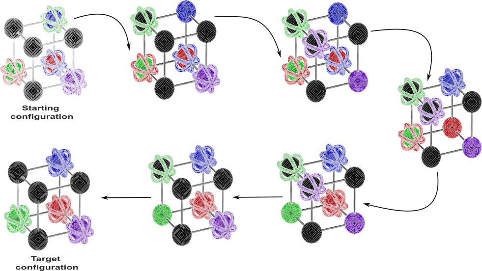

<!--(@Author: [Nono Saha Cyrille Merleau](#) and [Miguel O'malley](#) )-->
## Approximately Optimal Search on a Higher-dimensional Sliding Puzzle
This repository presents data and codes for the computational study of the high-dimensional sliding puzzle. Three methods are implemented here: evolutionary algorithm (EA), Reinforcement Learning (RL), and A* search.


**Figure 1:** Illustration of a solution for the high-dimensional puzzle for parameters $d=3, k=2$ and difficulty level $1$. 

For a given starting and target configuration, dimension $d$, face dimension $k$, and number of uncoloured vertices l, The sliding puzzle is built on a hypercube of a dimension $d$, i.e. $2^d - 1$ vertices. Several vertices ($2^d -l$) are coloured, and there is a ring with the same colour for each colour. The sliding puzzle consists of moving (or sliding) the rings to different free vertices until all the ring colours match the vertex colours.

The repo is organised as follows:

- [data](data/): The clean data used to produce the different plots presented in our paper.  The cleaned data are obtained by cleaning up the data generated from our file. For more details, please refer to the Python notebook [scripts/data_cleaning.py](scripts/data_cleaning.py)

- [cubicgame] (cubicgame): The standard classes and utility functions needed to run different methods. 
- [images](images/): The plots (in pdf) used in the paper and the Python notebook code are in [notebooks/plots.ipynb](notebooks/plots.ipynb).
- [src](src/): The source codes are organised into three main parts:

    - [as](src/as/main.py): It contains the A* search implementation.
    
    - [ea](src/ea/main.py): It contains the EA implementation, initialisation, mutation, selection, and EA functions.

    - [rl](src/rl/main.py): It contains the RL implementation.

# Requirements
To be able to run different algorithms, the following softwares are required:

- [Python version 3.11.3](https://www.python.org/downloads/release/python-3113/) or higher
- Numpy
- Pandas
- Scipy
- seaborn: for the plots
- matplotlib: for the plotting part.

To install all requirements automatically, including the setup of a conda environment called `cubicgame` via miniconda, type the following command:

```
make requirements
```
Please use the following command for `pip` installation. 

```
pip install -r requirements.txt & pip install ./cubicgame/ 
```

The installation was tested on the following operating systems:

* MacOS Mojave
* Debian Xfce 4.12

## How to run the program?
First, please clone the git repo using the command:

```
$ git clone [repo link](#)
$ cd CubicPuzzle
$ make requirements //In case the dependencies are not yet installed.  
$ cd src/
$ python ea/main.py python ea/main.py -N 1000 -mu 1.8 --level 0 --dim 3 -k 2 -T 100 --levy
```

For more details about the parameters, please use:

```bash
❯ python ea/main.py --help
usage: main.py [-h] [-mu MU] [-T T] [-N N] [-k K] [--job JOB] [--store] [--print] [--alpha ALPHA] [--level LEVEL]
[--dim DIM] [--levy]
	
Options:
  -h, --help     show this help message and exit
  -mu MU         Mutation rate (default: 1.8)
  -T T           Number of generations (default: 10)
  -N N           Initial population size (default: 10)
  -k K           Move dimension. When not given, the default value is k = dimension -1 (default: None)
  --job JOB      Number of jobs (default: 1)
  --store        store the output data (default: False)
  --print        run in a verbose mode (default: False)
  --alpha ALPHA  balancing parameter for the selection force fitness and number of moves (default: 0.15)
  --level LEVEL  Level of the puzzle difficulty. There are four levels: 0: easy (default: 0)
  --dim DIM      Dimension of the puzzle. There are only two considered 3 and 4 (default: 3)
  --levy         Use a Levy mutation scheme (default: False) 	  
```

For the A* and RL methods, please navigate the corresponding repository and use the help to see how to set parameters. 

```
$ python rl/main.py
```

## Citations
If you use this tool, please cite the following article

Merleau, N.S.C. et al. Approximately Optimal Search on a Higher-dimensional Sliding Puzzle. Arxiv:link (2024). [To be defined](#)
